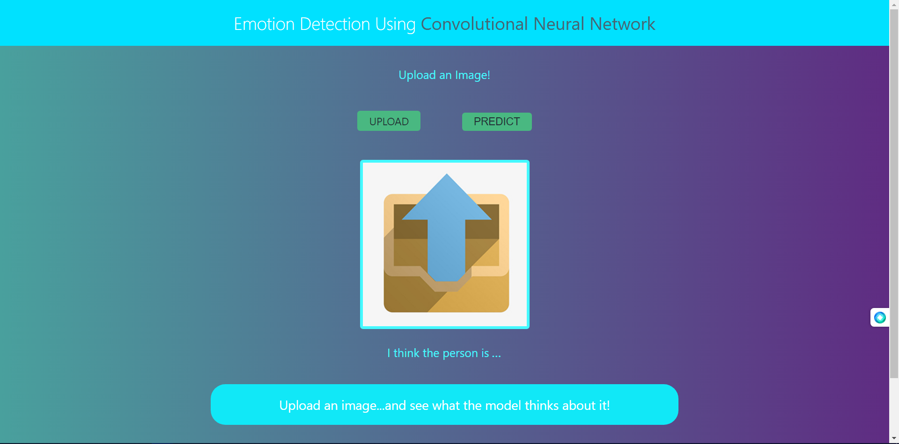

# Emotion Detection

## About

This application is a Computer Vision Application to detect the emotions of people from images.

## Installation

To install [Repository Name], follow these steps:

1. Clone Repositories.
2. Install Dependencies. (keras, tensorflow, flask)
3. Download any model following the steps below.
4. Rename the model to exp_det.h5

## Downloads

You can download any of the models from here:

- Check Model Performances from [here](https://github.com/sbk2k1/Emotion-Detection-using-CNN/tree/master/Models/Models%20-%203000%20images)
- Download the TensorFlow Model from [here](https://drive.google.com/drive/u/3/folders/1ilxMnQrnN0PVeVvUYAdzi34BKOIpbJJW)

## Screenshot

*App on Startup*

## Video

This Project is accompanied by a video tutorial available on YouTube. Watch the video below to get a visual walkthrough:

## Author

This project is developed and maintained by @sbk2k1.
